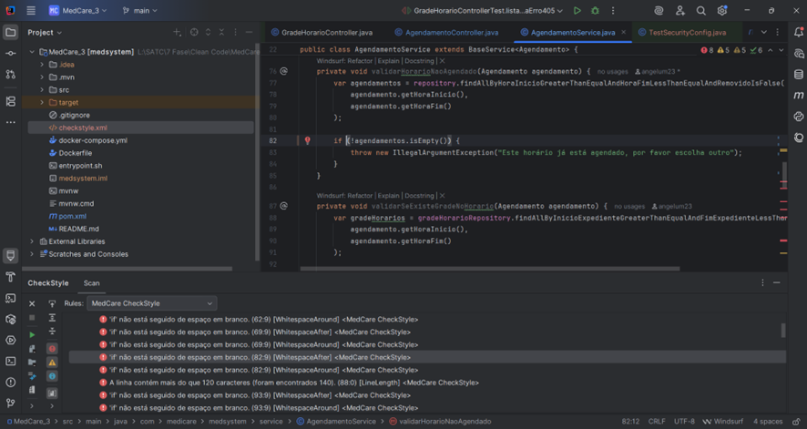

# O que é
Medcare é uma solução para agendamentos médicos, focada em entregar uma API que
realize os trabalhos de agendamento  de consultas médicas e afins.

# Processo
A API Medcare se encarrega de cobrir todo o fluxo de cadastro de médicos e pacientes,
consulta de horários, agendamentos de consultas, feedbacks, retornos médicos e encaminhamentos para outros médicos e consultas.

# <u>[Modelo físico](https://dbdiagram.io/d/6665e2909713410b05224ef1)</u>

# Rodando o docker (na pasta raiz)
- ./mvnw clean -f pom.xml
- ./mvnw package -f pom.xml (se der erro tem que rodar pelo intelliJ que da certo)
- docker build -t imgmedicare .
- docker run -p 8080:8080 --name medicare imgmedicare

## Documentação das tecnologias utilizadas
* [Official Apache Maven documentation](https://maven.apache.org/guides/index.html)
* [Spring Boot Maven Plugin Reference Guide](https://docs.spring.io/spring-boot/docs/3.3.0/maven-plugin/reference/html/)
* [Create an OCI image](https://docs.spring.io/spring-boot/docs/3.3.0/maven-plugin/reference/html/#build-image)
* [Spring for RabbitMQ](https://docs.spring.io/spring-boot/docs/3.3.0/reference/htmlsingle/index.html#messaging.amqp)
* [Spring for RabbitMQ Streams](https://docs.spring.io/spring-amqp/reference/stream.html)
* [Spring Data JPA](https://docs.spring.io/spring-boot/docs/3.3.0/reference/htmlsingle/index.html#data.sql.jpa-and-spring-data)
* [Spring Data Redis (Access+Driver)](https://docs.spring.io/spring-boot/docs/3.3.0/reference/htmlsingle/index.html#data.nosql.redis)
* [Spring Data Reactive Redis](https://docs.spring.io/spring-boot/docs/3.3.0/reference/htmlsingle/index.html#data.nosql.redis)
* [Spring Security](https://docs.spring.io/spring-boot/docs/3.3.0/reference/htmlsingle/index.html#web.security)
* [Spring Web](https://docs.spring.io/spring-boot/docs/3.3.0/reference/htmlsingle/index.html#web)

## Tutoriais de referencia

* [Messaging with RabbitMQ](https://spring.io/guides/gs/messaging-rabbitmq/)
* [Accessing Data with JPA](https://spring.io/guides/gs/accessing-data-jpa/)
* [Messaging with Redis](https://spring.io/guides/gs/messaging-redis/)
* [Messaging with Redis](https://spring.io/guides/gs/messaging-redis/)
* [Securing a Web Application](https://spring.io/guides/gs/securing-web/)
* [Spring Boot and OAuth2](https://spring.io/guides/tutorials/spring-boot-oauth2/)
* [Authenticating a User with LDAP](https://spring.io/guides/gs/authenticating-ldap/)
* [Building a RESTful Web Service](https://spring.io/guides/gs/rest-service/)
* [Serving Web Content with Spring MVC](https://spring.io/guides/gs/serving-web-content/)
* [Building REST services with Spring](https://spring.io/guides/tutorials/rest/)


## Análise dos Principais Problemas Detectados e suas Estratégias de Refatoração

Durante a análise do projeto original, diversos problemas foram identificados em diferentes níveis da aplicação. A seguir, listamos os principais pontos que motivaram a refatoração, juntamente com uma explicação do impacto de cada um deles:

### 1. **Nomenclatura Inadequada**
Foram encontrados diversos nomes de variáveis e métodos pouco descritivos, como `dto`, `entidade`, `id`, `registro`, entre outros, o que comprometia a legibilidade do código.

> **Correção:** Todas as variáveis e métodos foram renomeados com nomes claros e semânticos, melhorando a compreensão geral do código.

### 2. **Duplicação de Código**
Havia duplicação entre lógicas de validação e resposta em diferentes endpoints, especialmente nas camadas de controller.

> **Correção:** Extraímos métodos auxiliares e utilizamos classes de utilitários para consolidar essas validações.

### 3. **Falta de Testes Automatizados**
O projeto original não possuía nenhuma suíte de testes, dificultando a validação de novas alterações.

> **Correção:** Foram criados testes automatizados com `JUnit` e `MockMvc` cobrindo casos de sucesso e erro para os principais controllers (`PessoaController`, `AgendamentoController`, `GradeHorarioController`).

### 4. **Falta de Linter e Padronização**
O projeto original não utilizava nenhuma ferramenta de verificação automática de estilo, o que resultava em inconsistências como espaçamento inadequado, indentação incorreta e ausência de chaves.

> **Correção:** Integração com o **Checkstyle**, configurando regras como:
- `LineLength`
- `NeedBraces`
- `WhitespaceAround`
- `MethodLength`

## Pontos Positivos do Projeto Original

Alguns aspectos já estavam bem estruturados desde a versão original, demonstrando boas práticas já adotadas na criação do projeto inicial. Esses pontos foram mantidos por estarem dentro dos padrões de Clean Code e engenharia de software.

### 1. **Estrutura Geral e Modularização**
A divisão de pacotes como `controller`, `domain`, `dto`, `service` e `enums` já estava bem organizada, facilitando a navegação e compreensão do projeto.

### 2. **Uso do Spring Boot e JPA**
A integração com Spring Boot e o uso correto do JPA para persistência de dados já estavam implementados de forma adequada, seguindo convenções da framework.

### 3. **Camadas Bem Definidas**
A separação entre responsabilidades (controllers cuidando da API, services da lógica e domain da modelagem) já era bem respeitada.

## Refatorações Realizadas

As descrições das mudanças realizadas no código-fonte original foram documentadas e seguem os princípios discutidos na disciplina de Clean Code. Para detalhes específicos de cada alteração feita, consulte o arquivo [`CHANGELOG.md`](./CHANGELOG.md), onde constam as melhorias aplicadas, correções e novos recursos adicionados ao projeto.

## Descrição dos Testes Implementados

Durante a refatoração do projeto MedCare, foi implementada uma suíte de testes automatizados focada em cobrir os principais fluxos da aplicação, garantindo a confiabilidade das funcionalidades após alterações no código.

Os testes foram escritos utilizando JUnit 5, Mockito, e Spring MockMvc, e cobrem tanto os utilitários quanto os controllers da aplicação.

### Testes Unitários e de Integração Criados:

- **`ValidacaoUtilsTest`**  
  Testa os métodos de validação estáticos da aplicação.  
  Garante que as validações de campos obrigatórios, identificações e strings estejam funcionando corretamente.  
  Casos de sucesso e falha foram tratados.

- **`PaginadorTest`**  
  Valida o funcionamento da lógica de paginação customizada.  
  Garante que a paginação respeita os limites e quantidade de registros esperada.

- **`PessoaControllerTest`**  
  Testa os endpoints principais do controller de Pessoa.  
  Inclui inserção, listagem, recuperação, alteração e exclusão.  
  Simula os casos esperados com comportamento de serviço mockado.

- **`AgendamentoControllerTest`**  
  Testa o agendamento de consultas e o registro de folgas.  
  Inclui simulações de conflitos de horários e casos de erro na criação de agendamentos.

- **`GradeHorarioControllerTest`**  
  Testa a inserção, alteração, listagem e exclusão de horários disponíveis.  
  Verifica também a recuperação semanal.

- **`TestSecurityConfig`**  
  Garante que os testes de controllers não sejam impactados por autenticação durante a execução.  
  Sobrescreve a configuração de segurança original para permitir execução local dos testes.

---

## Linter com Checkstyle

O projeto foi integrado ao **Checkstyle** para garantir uma padronização no estilo de código, identificando problemas como:

- Falta de espaçamento;
- Linhas muito longas;
- Ausência de chaves;
- Más práticas de indentação.

A configuração utilizada está no arquivo [`checkstyle.xml`](./checkstyle.xml), que pode ser customizada conforme o padrão da equipe.

### Exemplo de aplicação

Abaixo, um exemplo real das sugestões feitas pelo Checkstyle diretamente no IntelliJ IDEA:



---

## Interfaces fluentes

Não foram implementadas interfaces fluentes no projeto, mas em certos pontos há a possibilidade de utilizá-las, como:

No arquivo ICacheListService, o código, excluindo o package e o import, está assim:

```java
public interface ICacheListService<T>
{
    public void setList(String key, List<T> value);
    public void leftPush(String key, T value);
    public void rightPush(String key, T value);
    public List<T> getList(String key);
    public void clearList(String key);
```

Para aplicar interfaces fluentes nele, podemos modificá-lo da seguinte forma:

```java
public interface ICacheListService<T> {
    public ICacheListService<T> setList(String key, List<T> value);
    public ICacheListService<T> leftPush(String key, T value);
    public ICacheListService<T> rightPush(String key, T value);
    public List<T> getList(String key);  // Essa linha é igual a original
    public ICacheListService<T> clearList(String key);
```

Uma implementação concreta desse novo código seria a seguinte:

```java
public class RedisCacheListService<T> implements ICacheListService<T> {
    
    @Override
    public ICacheListService<T> setList(String key, List<T> value) {
        // Lógica de implementação
        return this;
    }

    @Override
    public ICacheListService<T> leftPush(String key, T value) {
        // Lógica para leftPush
        return this;
    }
	// Os outros métodos seriam implantados de forma similar
}
```

Outro trecho de código onde interfaces fluentes podem ser utilizadas é este do arquivo PessoaController:

```java
@PostMapping("/InserirPessoa")
public ResponseEntity<Object> inserir(@RequestBody InserirPessoaDto dadosPessoa) {
    try {
        Integer idPessoa = service.salvarComFoto(dadosPessoa);
        return Success("Registro inserido com sucesso: " + idPessoa);
    } catch (Exception e) {
        return Error("Erro ao inserir registro! " + e.getMessage());
    }
}
```

Podemos modificá-lo da seguinte maneira: Primeiro, criar um build de respostas (na classe base ou utilitária):

```java
public class ResponseBuilder {
    private Object data;
    private String error;
    private HttpStatus status;

    public static ResponseBuilder success() {
        return new ResponseBuilder().withStatus(HttpStatus.OK);
    }

    public static ResponseBuilder error() {
        return new ResponseBuilder().withStatus(HttpStatus.BAD_REQUEST);
    }

    public ResponseBuilder withData(Object data) {
        this.data = data;
        return this;
    }

    public ResponseBuilder withError(String error) {
        this.error = error;
        return this;
    }

    public ResponseBuilder withStatus(HttpStatus status) {
        this.status = status;
        return this;
    }

    public ResponseEntity<Object> build() {
        Map<String, Object> response = new HashMap<>();
        if (data != null) response.put("data", data);
        if (error != null) response.put("error", error);
        return new ResponseEntity<>(response, status);
    }
}
```

Depois, um controller modificado:

```java
// Outras partes do código além da citada acima foram modificadas

@RestController
@RequestMapping("/Pessoa")
public class PessoaController extends BaseController<Pessoa> {
    // ... outros métodos

    @PostMapping("/InserirPessoa")
    public ResponseEntity<Object> inserir(@RequestBody InserirPessoaDto dadosPessoa) {
        try {
            Integer idPessoa = service.salvarComFoto(dadosPessoa);
            return ResponseBuilder.success()
                .withData(idPessoa)
                .withMessage("Registro inserido com sucesso")
                .build();
        } catch (Exception e) {
            return ResponseBuilder.error()
                .withError("Erro ao inserir registro: " + e.getMessage())
                .build();
        }
    }

    @GetMapping("/ListarPessoa")
    public ResponseEntity<Object> listar(
            @RequestParam(defaultValue = "0") int page,
            @RequestParam(defaultValue = "10") int rowsPerPage,
            @RequestParam(required = false) String tipo) {
        try {
            EnumTipoPessoa enumTipo = tipo != null ? EnumTipoPessoa.valueOf(tipo) : null;
            var pessoasEncontradas = service.listar(new ListarPessoaDto(page, rowsPerPage, enumTipo));
            
            return ResponseBuilder.success()
                .withData(pessoasEncontradas)
                .withPagination(page, rowsPerPage)
                .build();
        } catch (IllegalArgumentException e) {
            return ResponseBuilder.error()
                .withError("Tipo de pessoa inválido")
                .withDetails(Arrays.toString(EnumTipoPessoa.values()))
                .build();
        }
    }
}
```

Essas mudanças trazem uma série de benefícios para o código, como:

No primeiro exemplo:

* Encadeamentos naturais;
* Maior legibilidade para operações em sequência;
* Fácil composição de operações de cache;

No segundo exemplo:

* Construção flexível de respostas:
* Consistência nas respostas da API;
* Extensibilidade;
* Clareza no código do controller

---

## Documentação

**ENDPOINTS**

Imagem:
https://files.fm/u/7v9sxk32nf

**REQUISIÇÕES PESSOA**

**1 – Inserir Pessoa:**
POST

http://localhost:8080/Pessoa/InserirPessoa
```JSON
{

  “pessoa”: {

“nome”: “teste1”,

“tipo": 1,

“identificacao”: “00000000000”

},
“documento”:{

“urldocumento”: “www.teste.com/imagem.jpg”,

“descrição”: “teste”

}

}
```

Erros esperados:

- Erro ao inserir registro!


**2 – Alterar Pessoa:**
PUT

http://localhost:8080/Pessoa/AlterarPessoa

{

“pessoa”: {

	“nome”: “teste1”,
	
	“tipo": 1,
	
	“identificacao”: “00000000000”

	},

“documento”:{

	“urldocumento”: “www.teste.com/imagem.jpg”,
	
	“descrição”: “teste”

	}

}

Erros esperados:

- Erro ao alterar registro!


**3 – Listar Pessoa:**
GET

http://localhost:8080/Pessoa/ListarPessoa

{

"tipo": "Medico",

"page": 1,

"rowsPerPage": 10

}

Erros esperados:

- Erro ao recuperar registros!


**4 – Remover Pessoa:**
DELETE

http://localhost:8080/Pessoa/Remover?id={id}

Erros esperados:

- Erro ao remover registros!


**5 – Recuperar Pessoa:**
GET

http://localhost:8080/Pessoa/RecuperarPessoa?id={id}

Erros esperados:

- Erro ao recuperar registro!


**6- RecuperarTodos Pessoa:**
GET

http://localhost:8080/Pessoa/RecuperarTodos

Erros esperados:

- Erro ao recuperar registros!


**REQUISIÇÃO AGENDAMENTO**

**1 – Inserir Agendamento:**
POST

http://localhost:8080/Agendamento/InserirAgendamento

{

“agendamento”: {

	“tipo”: “Retorno”,
	
	“descricao”: “teste4”,
	
	“horaInicio”: “18-10-2024T08:00:00”,
	
	“horaFim”: “2024-10-16T08:45:00”,
	
	“dadosConsulta”: “teste1”

 	},

"documento": {

        "urlDocumento": "www.teste.com/imagem.jpg",
	
        "descricao": "teste"
	
    }

}

Erros esperados:

- Erro ao inserir resistro!

- Este horário já está agendado, por favor escolha outro”

- Nenhum horário disponível para o agendamento!


**2 – Alterar Agendamento:**
PUT

http://localhost:8080/Agendamento/Alterar

{

“agendamento”: {

	“tipo”: “Retorno”,
	
	“descricao”: “teste4”,
	
	“horaInicio”: “18-10-2024T08:00:00”,
	
	“horaFim”: “2024-10-16T08:45:00”,
	
	“dadosConsulta”: “teste1”,

 	},

"documento": {

        "urlDocumento": "www.teste.com/imagem.jpg",
	
        "descricao": "teste"
	
    }

Erros esperados:

- Erro ao alterar resgistro!

- Este horário já está agendado, por favor escolha outro!

- Nenhum horário disponível para o agendamento!


**3 – Listar Agendamento:**
GET

http://localhost:8080/Agendamento/ListarAgendamento

{

“tipo”: “Consulta”,

"page": 1,

"rowsPerPage": 10

}

Erros esperados:

- Erro ao recuperar registros!


**4 – Remover Agendamento:**
DELETE

http://localhost:8080/Agendamento/ Remover?id={id}

Erros esperados:

- Erro ao remover registro!


**5 - Recuperar Agendamento:**
GET

http://localhost:8080/Agendamento/Recuperar?id={id}

Erros esperados:

- Erro ao recuperar registro!


**6 – Folgar Agendamento:**
POST

http://localhost:8080/Agendamento/Folgar?dia={data}

Erros esperados:

- Erro ao criar folga!

- Este horário já está agendado, por favor escolha outro”

- Nenhum horário disponível para o agendamento!


**7 – RecuperarDia Agendamento:**
GET

http://localhost:8080/Agendamento/RecuperarDia

{

“tipo”: “Folga”,

“horaInicio”: “18-10-2024T08:00:00”,

“horaFim”: “2024-10-16T08:45:00” ,

“diaSemana”: “Quinta”

}

Erros esperados:

- Erro ao recuperar agendamentos do dia!


**8 - RecuperarTodos Agendamento:**
GET

http://localhost:8080/Agendamento/RecuperarTodos

Erros esperados:

- Erro ao recuperar registros!


**REQUISIÇÃO GRADEHORARIO**

**1 – Inserir GradeHorario:**
POST

http://localhost:8080/GradeHorario/Inserir

{

“inicioExpediente”: “18-10-2024T08:00:00”,

“fimExpediente”: “2024-10-16T08:45:00”,

“diaSemana”: “Quinta",

“descrição”: “teste”

}

Erros esperados:

- Erro ao inserir registro!


**2 – Alterar GradeHorario:**
PUT

http://localhost:8080/GradeHorario/Alterar

{

“inicioExpediente”: “18-10-2024T08:00:00”,

“fimExpediente”: “2024-10-16T08:45:00”,

“diaSemana”: “Quinta",

“Descrição”: “teste”

}

Erros esperados:

- Erro ao alterar registro!


**3 – Listar GradeHorario:**
GET

http://localhost:8080/GradeHorario/ListarGradeHorario

{

"page": 1,

"rowsPerPage": 10

}

Erros esperados:

- Erro ao recuperar registros!


**4 – Remover GradeHorario:**
DELETE

http://localhost:8080/GardeHorario/Remover?id={id}

Erros esperados:

- Erro ao remover registro!


**5 – InserirSemanal GradeHorario:**
POST

http://localhost:8080/GradeHorario/InserirSemanal

{

“quinta”:{

	“inicioExpediente”: “18-10-2024T08:00:00”,
 
	“fimExpediente”: “2024-10-16T08:45:00”,
 
	“diaSemana”: “Quinta",
 
 	“Descrição”: “teste”

}

}

Erros esperados:

- Erro ao recuperar registros!


**7 – Recuperar GradeHorario:**
GET

http://localhost:8080/GradeHorario/Recuperar?id={id}

Erros esperados:

- Erro ao recuperar registro!


**8- RecuperarTodos GradeHorario:**
GET

http://localhost:8080/GradeHorario/RecuperarTodos


Erros esperados:

- Erro ao recuperar registros!

**REQUISIÇÃO AJUDA**

**Ajuda:**
GET

http://localhost:8080/Ajuda

